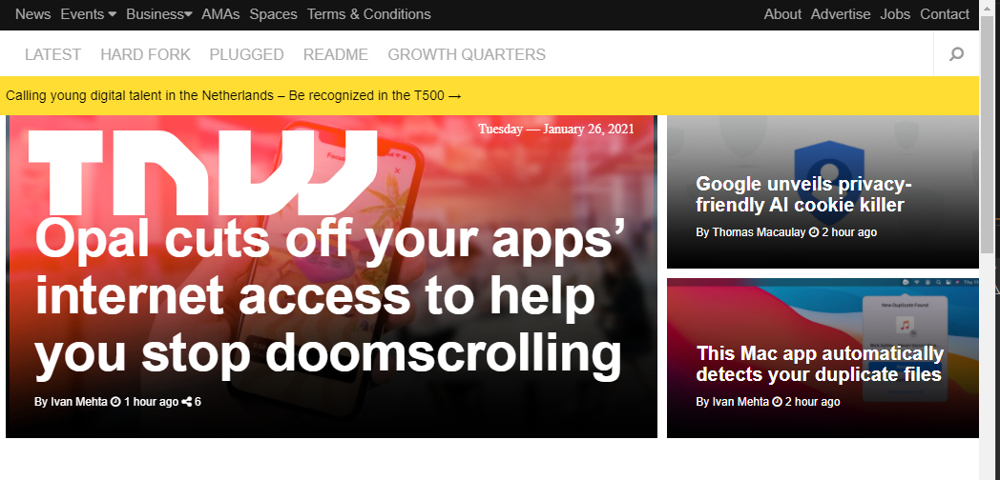

# The Next Web Clone
Microverse HTML and CSS Week 2 Project
>This We simulated the Next Web page by cloning and building version of the page to respond to different screen sizes.
>by applying the best practices, related to repositories and front-end code. To create Interfaces (UIs) that will adapt to different devices (screen size).
> Also learn how to collaborate better with partners.

## Built With

- Html,
- Css (Media Queries)

## Linters Used:

- Lighthouse
- Weblint
- Stylelint

## Live Demo

- Project [Live Demo Link](https://notlfish.github.io/times-article-clone/)

## Getting Started

- To get a local copy up and running follow these simple example steps.

#### Prerequisites

- Have a compatible web browser that supports HTML5 and CSS3 in order to correctly display the website.
- A text editor in order to view and edit code. Popular text editors include VSCode and Notepad++.

#### Setup

On GitHub bash 
    _git clone https://github.com/DanSam5K/the-next-web-clone.git_

#### Usage

- Most Operative Systems have the .html file extension associated to open with your default web browser.
> In order to review the code, you may use your web browser inspect element option or open directly with a text editor.

- In the cloned folder access open
    _index.html_

## Authors

👤 **Lucas Ferrari Soto**

- GitHub: [@notlfish](https://github.com/notlfish)
- Twitter: [@twitterhandle](https://twitter.com/LucasFerrariSo1)
- LinkedIn: [LinkedIn](https://linkedin.com/lucas-mauricio-ferrari-soto-472a3515a)

👤 **Daniel Samuel**

- GitHub: [DanSam5K](https://github.com/DanSam5K)
- Twitter: [@_dan_sam](https://twitter.com/_dan_sam)
- LinkedIn: [LinkedIn](https://www.linkedin.com/in/dansamuel/)

## 🤝 Contributing

Contributions, issues, and feature requests are welcome!

Feel free to check the issues page.
Show your support

Give us a ⭐️ if you like this project!
Acknowledgments